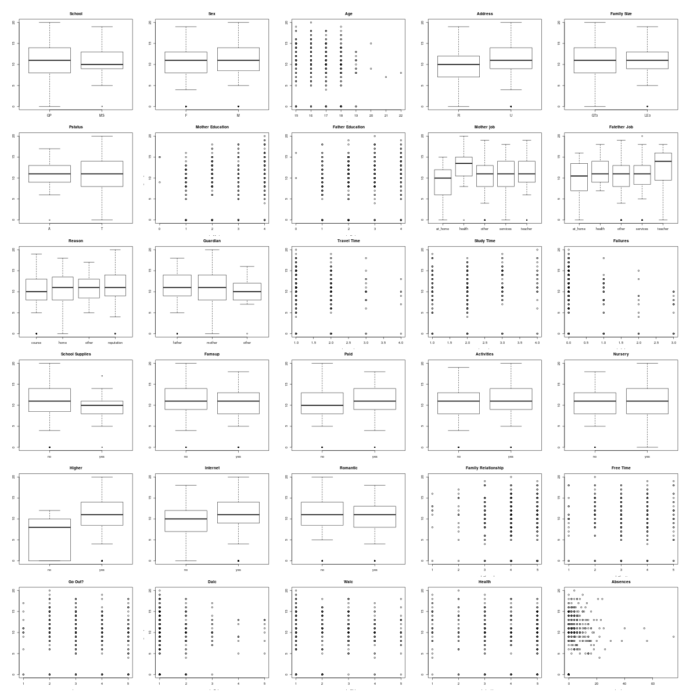

# Student Performance Prediction
### Amy Goldlist, January 2018

## Introduction

One of the most challenging parts of being a math instructor is not knowing what the factors are that determine student success.  We *know* that by studying and working practice problems, students can improve scores, but it's hard to quantify this.  There are so many factors, and even the most important factors have little influence.  I know that this is a difficult problem, but my goal is to use some machine learning and feature selection methods to determine what some of the important factors may be.

## Data
I used the **Student Performance Dataset** data set  available from the UCI Machine Learning library [here](https://archive.ics.uci.edu/ml/datasets/student+performance).  This dataset consists of two CSV files, one for math scores and one for Portuguese language scores.  This data was all gathered in Portugal, and has several intermediate grade scores, along with 30 different features, showing demographics of the student and family.  

I chose to focus exclusively on the math dataset.  My reasoning for this is that there is overlap between the two sets, but it's hard to see which students are repeated.  As well, though I find all student performance metrics interesting, I felt that just focusing on one subject would be more interesting.

## Analyses

##### Clean and Cut
The first thing I did was clean and recode the data.  I then cut my data into two sets, 20% testing data, and 80% training data.  All analyses and data exploration was conducted on just the training data, unless otherwise stated.

##### Explore the data
The data set contains 30 features and 3 responses.  I chose to eliminate the first two intermediate grades (G1 and G2) and focus exclusively on the final grade (G3).

###### Features
All 30 features are described fully [here](data/student.txt).  This file came with the dataset.  I've broken them into Categories

* **demographics**: Age, sex, health status (health), Address (Urban/Rural), family size (famsize)
* **Parent's info**: Which parent has guardianship, (guardian) cohabitation status(Pstatus), Mother's education (Medu) and job, (Mjob), father's education (Fedu) and job (Fjob), famsup (family educational support)
* **School info**: school, reason school was chosen, travel time, and study time, failures (previous failures), absences, extra school support (schoolsup)
* **Activities**: Whether they take extra math classes (paid), activities, whether they have internet in home (internet)
* **Education**: whether attended nursery school (nursery), whether they want to attend post -secondary (higher)
* **Personal life**: Whether they are in a romantic relationship (romantic), quality of family relationships (famrel), how much freetime they have (freetime), how often they go out with friends (goout), their alcohol consumption during the week (Dalc) and on weekends (Walc)

The plot below shows each feature plotted against the final math grade (G3)



It should be fairly apparent that there is no perfect predictor.  While some charts show differences, the only factor which seems to show a correlation is whether a student wants to attend post secondary school (higher).  This is more likely causal in the opposite direction, where students with good grades are more likely to think about post-secondary school.

##### Train a first model
I considered a linear model, but after looking at the visualizations, I did not think it would be a good fit for the data.  However, I still thought Regression was correct, so I chose to use Support Vector Regression (SVR) with an RBF kernel.  I used all 30 features for this model.

I used 10-fold cross validation to select likely hyperparameters.  I used `sklearn` for Python for this step.  In the end, I chose to use the following hyperparameters for my model:

```
model = SVR(epsilon=0, kernel="rbf", C = 5000, gamma = 0.01)
```

This model had a Mean Squared Error (MSE) of 5.53e-08.  

#####  Test my first model
I was happy enough with my first model that I decided to test it on my test set.  This gave me a disappointing result of MSE = 29.73.

#### Back to the drawing board.
The problem with my model was that it overfit, leading to a high approximation error.  This makes sense, as we can see from the plots above, some of these features don't seem to have an effect on the grade.

#### Forward selection
In order to choose a smaller set of features, I performed a forward selection algorithm.  Though I did try to write my own, I used one created for the solutions from DSCI 573 lab 1.  After using this method, I reduced my feature set to just 10 features:

* failures:  Number of past class failures
* guardian: Who has guardianship, "mother", "father" or "other"
* traveltime: home to school time
* Fedu: father's education
* school Sup: extra educational support
* school: Which school they attend
* famsize: family size
* studytime: weekly study time
* sex: female or male (with no other options)
* romantic: In a romantic relationship

#### Fit and test model 2

I fit the same SVM model as model 1 on the training data, but this time with only the 10 features above.  I then tested it on the test data, getting a training MSE score of 12.58 and a test MSE score of 25.00, a much lower approximation error.

##### A success?

Though we have a model which isn't an amazing predictor, the more important exercise was in identifying a set of features which are more relevant to student success.  

##### Next steps

Look at each of the features selected, and see whether there is a measurable effect.

## Citation:
P. Cortez and A. Silva. Using Data Mining to Predict Secondary School Student Performance. In A. Brito and J. Teixeira Eds., Proceedings of 5th FUture BUsiness TEChnology Conference (FUBUTEC 2008) pp. 5-12, Porto, Portugal, April, 2008, EUROSIS, ISBN 978-9077381-39-7.   [Online](http://www3.dsi.uminho.pt/pcortez/student.pdf) available.
